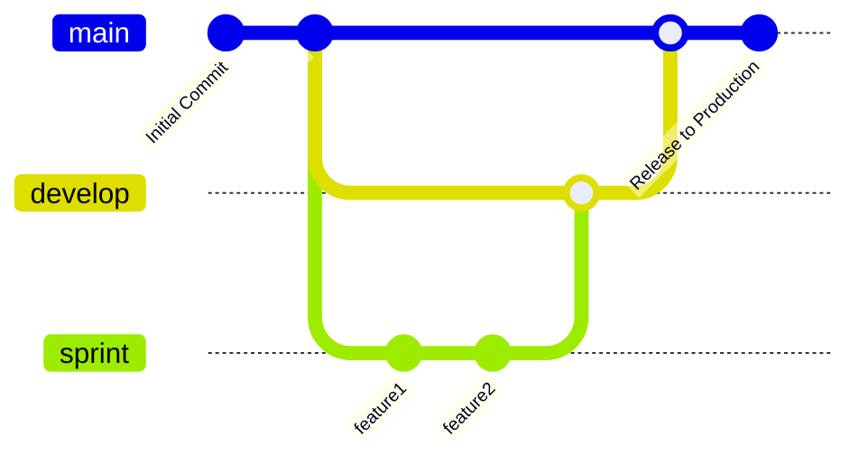

# Computer Vision Pipeline (CVP)
Code repository for the BDSC Computer Vision Pipeline project.

## Project Goals
- Develop a flexible architecture for implementing image classification models
- Demonstrate use of the pipeline on sample datasets

## Features


## Tech Stack
The following technologies are utilized in this project:
  - [List of programs/packages]

## Quick Start
This project assumes you have the following software installed:
  - Git
  - A command line interface (CLI)
  - Python (>= 3.14)
    - pipenv (>= 2026.5.2)

### Setup
  - Open a new CLI instance in the desired file location
  - Run `git clone https://github.com/LiamSpillane2/Computer-Vision-Pipeline.git`
  - Run `pipenv install`
    - Run `py -m pipenv install` if pipenv is not added to PATH

##  Repository Structure
```text
Computer-Vision-Pipeline/
├── config/                       # Configuration files
├── data/                         # Dataset storage
│   ├── license_plate_detection/  # License plate dataset
│   └── weld_defects/             # Weld defects dataset
├── models/                       # Files of trained models
├── notebooks/                    # Jupyter notebooks for data exploration
├── src/                          # Main body of source code
│   ├── models/                   # Scripts to train and run models
│   └── preprocessing/            # Scripts to prepare data for model ingestion
├── tests/                        # Unit and integration tests
├── utils/                        # General use utility scripts
├── .gitignore                    # Filename patterns to exclude
├── CHANGE_LOG.md                 # Information on major changes
├── CODE_OF_CONDUCT.md            # Conduct guidelines
├── Pipfile                       # Pipenv environment configuration file
├── Pipfile.lock                  # Pipenv environment lock file
└── README.md                     # Project description and setup instructions
```
***
# BDSC - Computer Vision Project - Github Branching Strategy

## Branching Strategy

A branching strategy defines how developers create, manage and merge branches in a version control system like Git to ensure smooth collaboration and organized code development. Provides clear rules for writing, merging and deploying code, and helps keep the repository structured and maintainable.  The goal is to reduce merge conflicts when multiple developers work simultaneously.

## Strategy Selection

The Computer Vision Project development team will utilize a structure similar to git flow.

### Branching

Features of the flow

**Master**: Represent the production-ready state of code.

**Develop**: Represents the latest development changes.

**Sprint branches**: Are created from the develop branch for sprint work on features, merged back to develop after completion, and then deleted by the developer after merged if not needed.


***
## Git Strategy
Git uses the following command to checkout and switch to a new branch.  Our team will create a new branch off the develop branch with the following ***naming convention:*** <sprint#_feature> ex. (***Sprint2_model1_training***, ***Sprint3_model2_fitting***)
```git
    git checkout -b <new-branch>
```
The developer/s will do their work off the \<new-branch\>.  When testing is completed and ready for deployment, the added sprint branch will be merged back to the develop branch.  

1. Run git fetch origin to get the latest changes from the remote.
2. Switch to the dev branch for merge.
3. Update it with git pull origin dev.
4. Merge the sprint branch with git merge ***feature-branch-name***.
5. Resolve any merge conflicts if prompted, then git add and git commit the resolutions.
6. Push the updated branch to the BDSC remote repository with git push origin dev.
7. Do not run any branch deletion commands (e.g., git branch -d)—this keeps the source branch intact.

```git
   git fetch origin dev
   git checkout dev
   git merge feature-branch-name
   git add
   git commit
   git push origin dev
```
