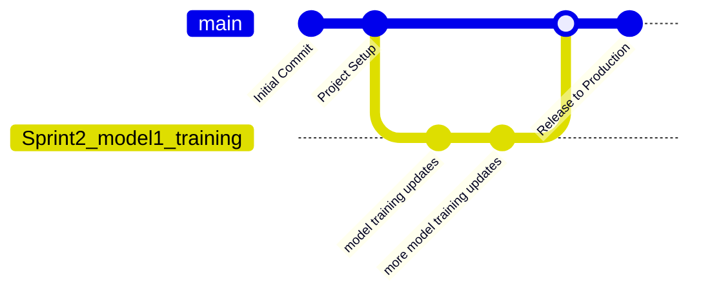

# Computer Vision Pipeline (CVP)
Code repository for the BDSC Computer Vision Pipeline project.

## Project Goals
- Develop a flexible architecture for implementing image classification models
- Demonstrate use of the pipeline on sample datasets

## Features


## Tech Stack
The following technologies are utilized in this project:
  - [List of programs/packages]

## Quick Start
This project assumes you have the following software installed:
  - A command line interface (CLI)
  - Git
  - GitHub CLI
  - Python (>= 3.14)
    - pipenv (>= 2026.5.2)

### Setup
  - Open a new CLI instance in the desired file location
  - Run `git clone https://github.com/LiamSpillane2/Computer-Vision-Pipeline.git`
  - Run `pipenv install`
    - Run `py -m pipenv install` if pipenv is not added to PATH

##  Repository Structure
```text
Computer-Vision-Pipeline/
├── config/                       # Configuration files
├── data/                         # Dataset storage
│   ├── license_plate_detection/  # License plate dataset
│   └── weld_defects/             # Weld defects dataset
├── models/                       # Files of trained models
├── notebooks/                    # Jupyter notebooks for data exploration
├── src/                          # Main body of source code
│   ├── models/                   # Scripts to train and run models
│   └── preprocessing/            # Scripts to prepare data for model ingestion
├── tests/                        # Unit and integration tests
├── utils/                        # General use utility scripts
├── .gitignore                    # Filename patterns to exclude
├── CHANGE_LOG.md                 # Information on major changes
├── CODE_OF_CONDUCT.md            # Conduct guidelines
├── Pipfile                       # Pipenv environment configuration file
├── Pipfile.lock                  # Pipenv environment lock file
└── README.md                     # Project description and setup instructions
```
***
# GitHub Branching Strategy

A branching strategy defines how developers create, manage, and merge branches in a version control system - like GitHub - to ensure smooth collaboration and organized code development. It provides clear rules for writing, merging, and deploying code, and helps keep the repository structured and maintainable. The goal of a branching strategy is to reduce merge conflicts when multiple developers are working simultaneously.

## Strategy Selection

The Computer Vision Project development team will utilize a structure similar to GitHub Flow.

### Branching

**main**: Represents the primary and production-ready branch of the repository. All approved and tested code changes are merged into `main` through pull requests.

**Sprint branches**: Created directly from the main branch for feature development during a sprint. After feature development and testing is completed, the sprint branch is merged back into `main` through a pull request.

**Naming Convention**: <Sprint#_feature_name> Ex. Sprint2_model1_training



***
## Git Workflow

### Creating a Sprint Branch

Developers can create a new sprint branch from `main` using the following CLI commands:
```git
git pull
git checkout main
git checkout -b <new-branch-name>
```

**Example**:
```git
git checkout -b Sprint2_model1_training
```

All development work should be completed within the sprint branch

## Pull Request Process 
Once feature development and testing is complete, developers should create a pull request so their sprint branch can be reviewed and approved for merging into `main`.

1. **Commit sprint branch in remote repo**
    ```git
    git commit -m "<commit-message>"
    git push origin <branch-name>
    ```

2. **Create pull request using GitHub CLI**

    *Automatic Pull Request Creation*
    ```git
    gh pr create --fill
    ```
  
    `--fill` will attempt to automatically fill in the base, head, title, and body values using commit history.
  
    *Manual Pull Request Creation* 
    ```git
    gh pr create --base main --head <branch-name> --title "<title>" --body "<body>"
    ```

**Branch Retention Policy**

Sprint branches may be deleted immediately upon merging, but can be retained for future use if deemed necessary.

## Example Workflow
```git
git pull
git checkout main
git checkout -b Sprint2_model1_training

...
<development-work>
...

git add -A
git commit -m "Example text"
git push origin Sprint2_model1_training
gh pr create --fill
```