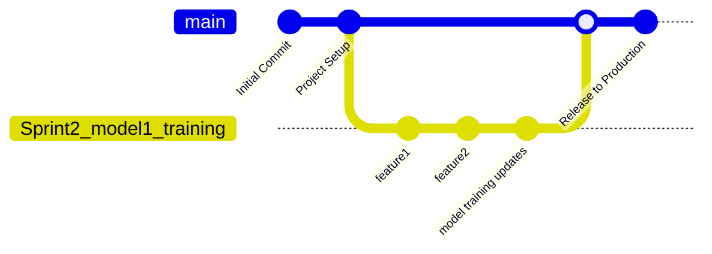

# Computer Vision Pipeline (CVP)
Code repository for the BDSC Computer Vision Pipeline project.

## Project Goals
- Develop a flexible architecture for implementing image classification models
- Demonstrate use of the pipeline on sample datasets

## Features


## Tech Stack
The following technologies are utilized in this project:
  - [List of programs/packages]

## Quick Start
This project assumes you have the following software installed:
  - Git
  - A command line interface (CLI)
  - Python (>= 3.14)
    - pipenv (>= 2026.5.2)
  - GH CLI (Github CLI for PR commands)

### Setup
  - Open a new CLI instance in the desired file location
  - Run `git clone https://github.com/LiamSpillane2/Computer-Vision-Pipeline.git`
  - Run `pipenv install`
    - Run `py -m pipenv install` if pipenv is not added to PATH

##  Repository Structure
```text
Computer-Vision-Pipeline/
├── config/                       # Configuration files
├── data/                         # Dataset storage
│   ├── license_plate_detection/  # License plate dataset
│   └── weld_defects/             # Weld defects dataset
├── models/                       # Files of trained models
├── notebooks/                    # Jupyter notebooks for data exploration
├── src/                          # Main body of source code
│   ├── models/                   # Scripts to train and run models
│   └── preprocessing/            # Scripts to prepare data for model ingestion
├── tests/                        # Unit and integration tests
├── utils/                        # General use utility scripts
├── .gitignore                    # Filename patterns to exclude
├── CHANGE_LOG.md                 # Information on major changes
├── CODE_OF_CONDUCT.md            # Conduct guidelines
├── Pipfile                       # Pipenv environment configuration file
├── Pipfile.lock                  # Pipenv environment lock file
└── README.md                     # Project description and setup instructions
```
***
# BDSC - Computer Vision Project - Github Branching Strategy

## Branching Strategy

A branching strategy defines how developers create, manage and merge branches in a version control system like Git to ensure smooth collaboration and organized code development. Provides clear rules for writing, merging and deploying code, and helps keep the repository structured and maintainable.  The goal is to reduce merge conflicts when multiple developers work simultaneously.

## Strategy Selection

The Computer Vision Project development team will utilize a structure similar to git flow.

### Branching

**main**: Represent the primary and production-ready branch of the repository. All approved and tested code changes are merged into main through pull requests.

**Sprint branches**: Created directly from the main branch for feature developement during a sprint. After developement and testing are completed, the print branch branch is merged back into main through a pull request.

**Naming Convention**: <sprint#_feature> Ex. Sprint2_model1_training


***
## Git Workflow

**Creating a Sprint Branch**

Developers create a new sprint branch from main using:
```git
git checkout main
git pull origin main
git checkout -b <new-branch>
```
*Example*: git checkout -b Sprint2_model1_training

All development work should be completed within the sprint branch

## Pull Request Process 
When developement and testing are complete, developers should submit a pull request into the main branch for review and approval.

1. Push sprint branch to remote repo
   ```git
   git push origin <feature-branch-name>
   ```
**Example:**
   ```git
   git push origin Sprint2_model1_training
   ```
2. Create Pull Request using Github CLI

**Automatic Pull Request generation**
   Open a pull request from the sprint branch into main for code review and approval.
   ```git
   gh pr create --fill
   ```

   --fill will automatically attempt to fill in the the title and body using commit history

   **Manual Pull Request creation** 
   ```git
   gh pr create --base main --head <naming convention> \
   --title " " \
   --body " "
  ```

**Branch Retention Policy**
Sprint branches may remain in the repoisitory after merging unless the team decides they are no longer needed.

Avoid automatic deletion commands unless approved by the team:
```git
git branch -d <branch-name>
```
## Example Workflow
```git
git checkout main
git pull origin main
git checkout -b Sprint2_model1_training

# Development work happens here

git add .
git commit - m "Example text"
git push origin Sprint2_model1_training

gh pr create --fill
```
Create a pull request into main for the repo Admin to approve 
